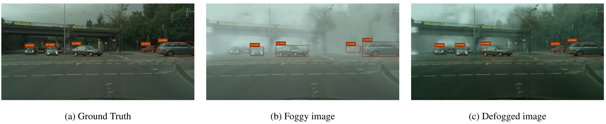

# From Filters to VLMs: Benchmarking Defogging Methods through Object Detection and Segmentation Performance

<!--- TODO: Add paper link --->This is the official implementation for the WACV 2026 paper, "From Filters to VLMs: Benchmarking Defogging Methods through Object Detection and Segmentation Performance." Our work provides a comprehensive benchmark for evaluating how various defogging methods impact the performance of downstream object detection and segmentation tasks.

<p align="center">
   <!--- TODO: Upload one of the result images and replace this link --->
  <br>
  <em style="display: block; text-align: center;">Qualitative comparison showing the ground truth (left) and the foggy image (center), with the defogged output (right).</em>
</p>

## Overview

 Object detection and segmentation models often falter in adverse weather conditions like fog. This project investigates which "defogging" strategies actually improve the performance of these critical downstream vision tasks.We benchmark a wide range of methods, including:

 - Classical Filters
 - Traditional image processing techniques
 - Modern Learned Restorers
 - Deep learning models like Dehazeformer
 - Generative Models: Advanced models such as ControlNet and Flux for image-to-image translation
 - VLM Editing: Prompt-driven editing using Visual-Language Models.
 
 Performance is measured using both quantitative metrics (mAP for object detection, PQ for segmentation) on the Foggy Cityscapes dataset and a novel qualitative assessment using a VLM judge.

## Getting Started

### Prerequisites

- Python 3.8+
- PyTorch 2.0+
- A CUDA-enabled GPU is highly recommended.

### Dataset

Our experiments rely on the Foggy Cityscapes dataset. Please download it from the official source and place it according to each method's requirements. [Link to Foggy Cityscapes dataset.](https://www.cityscapes-dataset.com/dataset-overview/)


### Running the code

Each folder contains scripts to run the respective defogging methods, as well as evaluation scripts for object detection and segmentation. Please refer to the README files within each folder for specific instructions. As an example for Dehazeformer, see [evaluation README](./eval/object_detection//README.md).


<!-- 
### Installation

Clone the repository:

```bash
git clone [https://github.com/your-username/FoggyDetect.git](https://github.com/your-username/FoggyDetect.git)
cd FoggyDetect
```

Create a virtual environment and install dependencies:

```bash
python -m venv venv
source venv/bin/activate
pip install -r requirements.txt
```


### How to Run the Benchmark

The evaluation process involves three main steps:

1. Generate Defogged Images
Run the inference scripts within each model's respective folder. The scripts should take a directory of foggy images as input and save the defogged results to an output directory.
Example with Dehazeformer:

```bash
cd dehazeformer/
python run_inference.py --input_dir ../data/foggy_cityscapes/ --output_dir ../results/dehazeformer/
```

(Note: Adapt the commands and arguments for controlnet and flux based on their specific implementations.)

2. Quantitative Evaluation

Use the scripts in the evaluation/ folder to run object detection and segmentation models on the newly generated defogged images.

```bash
cd evaluation/
# Run object detection
python detect.py --data_path ../results/dehazeformer/ --weights path/to/yolo_weights.pt

# Run panoptic segmentation
python segment.py --data_path ../results/dehazeformer/ --weights path/to/segmentation_weights.pt
```

3. Qualitative Evaluation

Finally, use our VLM judge to score the qualitative aspects of the defogged outputs, such as artifact reduction and detail preservation.

```bash
cd vlm_judge/
python judge.py --input_dir ../results/dehazeformer/ --output_file ../results/vlm_scores.json
``` -->

## Results

Our study reveals that while modern restorers show promise, no single method provides a universal boost to downstream perception tasks. Interestingly, some classical filters remain surprisingly competitive.

| Method                       |        mAP |        PQ |        RQ |        SQ | Qual. Score |
| ---------------------------- | ---------: | --------: | --------: | --------: | -----------: |
| Ground Truth (GT)            | 0.2560 | 100.0 | 100.0 | 100.0 |        34.81 |
| DehazeFormer Trained         |     0.2557 |      74.4 |      83.9 |      88.4 |          29.74 |
| DehazeFormer Untrained     |     0.2379 |      63.0 |      74.2 |      84.6 |          24.20 |
| Flux (CoT) |     0.2376 |      59.7 |      82.8 |      71.7 |          26.19 |

For a complete analysis, please refer to our paper.
<!--- TODO: Add paper link --->

## Citation

If you find this repository useful for your research, please cite our paper:

```
@inproceedings{yourname2026vlmdefog,
  title={{From Filters to VLMs: Benchmarking Defogging Methods through Object Detection and Segmentation Performance}},
  author={Your Name and Co-authors},
  booktitle={Winter Conference on Applications of Computer Vision (WACV)},
  year={2026}
}
```

## License

This project is licensed under the MIT License. See the LICENSE file for more details.
